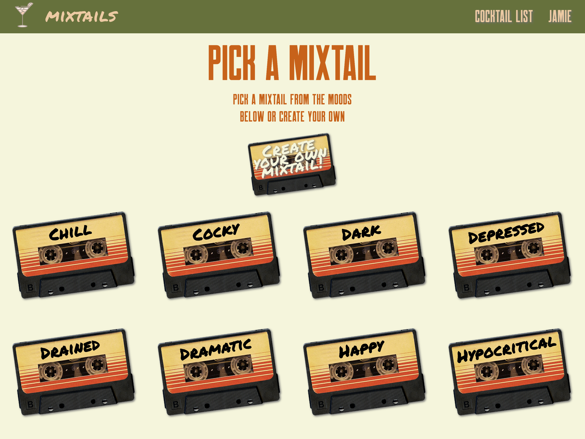

# ___Project Proposal___

<!-- ## Project Proposal -->

You ever feel like you can't choose what to drink?

### __Welcome to Mixtails__
#### By: <u>___Fetch 75___</u>

# App name: Mixtails

# Getting Started
### <u>Trello</u>
[Link](https://trello.com/b/Qon5Qeby/project-4)

### App <u>[Here](https://mixtails.herokuapp.com/home)</u>
## <u>Technologies Used:</u>
* React
* Express
* Node.js
* Mongodb 
* HTML/CSS 

## <u>Screenshots of our app in the wild</u>
### Home Page

### Moods Page

### Flavours Page

## <u>Freezer Features</u>
* Improve responsiveness of website
* Create a Cocktail Show Page for people to be able share cocktail recipe and info
* Hitting the Spotify Api 
* Add AWS
* Implement Weather API and sort drinks by weather at your location

## <u>Proposal ERD and Wireframe</u>
### <u>ERD</u>

### <u>Wireframe</u>

