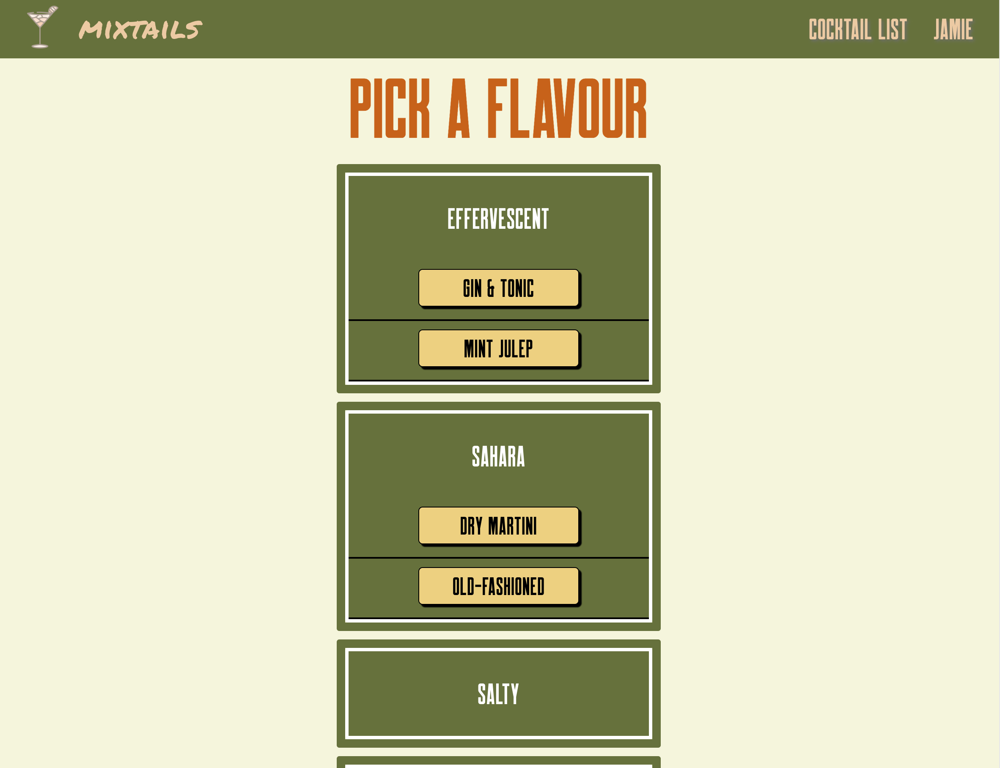

# ___Mixtails___

Mixtails helps you set the mood of your evening - combine a playlist of songs with a cocktail into a 'mixtail'. Users can log in, create mixtails, browse others' and share their own.

Here's a link to [the deployed app](https://mixtails.herokuapp.com/).

## <u>Technologies Used:</u>
* React
* Express
* Node.js
* MongoDB
* HTML/CSS 

## <u>Screenshots of Mixtails in the wild</u>
### Home Page

### Moods Page

### Flavours Page

## <u>Freezer Features</u>
* Improve responsiveness of website
* Create a Cocktail Show Page for people to be able share cocktail recipe and info
* Hitting the Spotify Api 
* Add AWS
* Implement Weather API and sort drinks by weather at your location

## <u>Proposal ERD and Wireframe</u>
### <u>ERD</u>

### <u>Wireframe</u>

